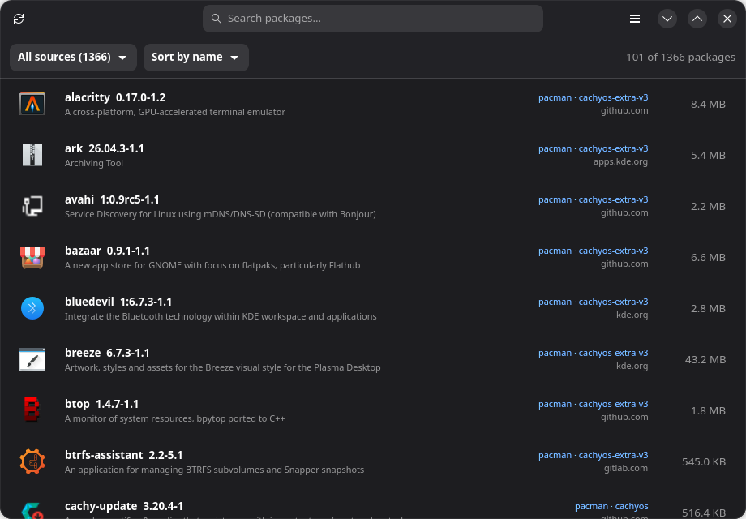
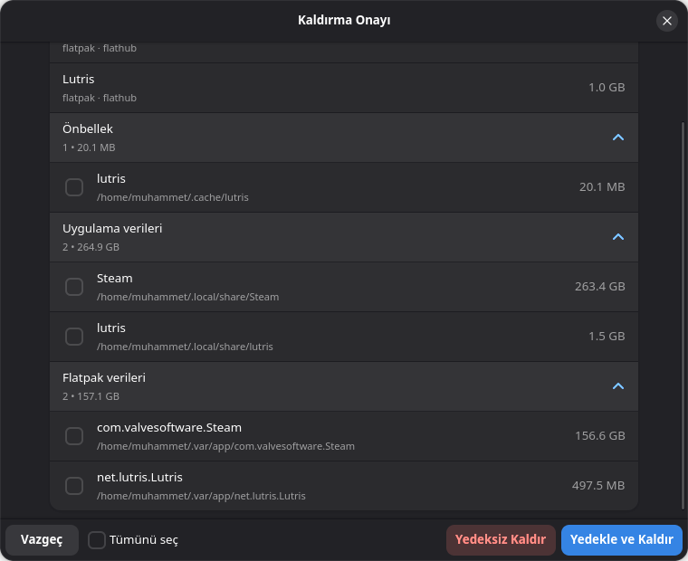
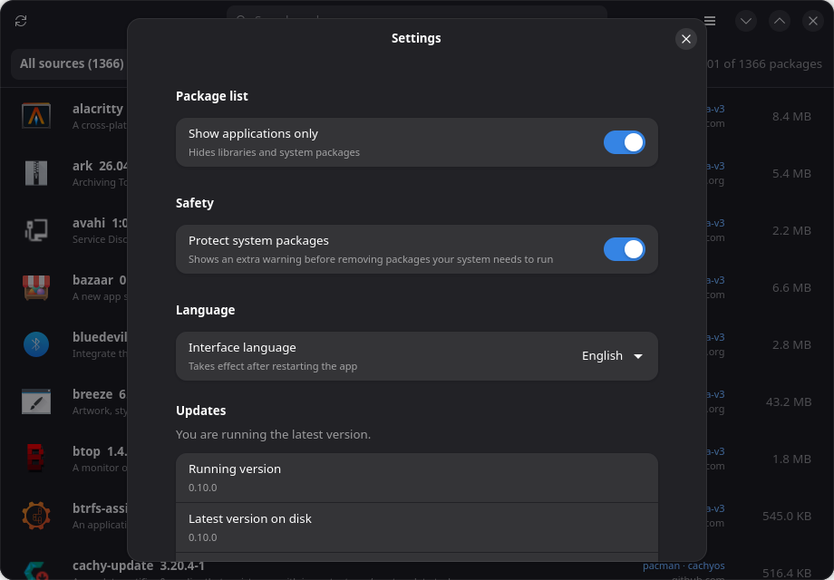

# PackWarden 🛡️📦

**The bulk application manager for every Linux distribution.**

Removing software on Linux is scattered work. Applications come from
pacman, APT, DNF, Flatpak, Snap and AppImage, and each source needs its
own commands. When something is uninstalled, its settings and caches
stay behind and quietly eat your disk.

PackWarden puts all of it in one window. It shows every installed
application from every source on your system. You can search, sort by
size, select as many applications as you want and remove them with a
single confirmation. PackWarden then finds the leftover files, shows
them with their sizes, and saves a backup before anything is deleted.
A protection shield guards critical system packages, so a bulk cleanup
can never break your computer.

Veterans get one fast tool instead of a pile of commands. Windows
switchers get the Bulk Crap Uninstaller they have been missing.
Everyone gets a cleaner system.

| Main window |
|---|
|  |

| Removal with leftover cleanup | Settings |
|---|---|
|  |  |

## License

GPL-3.0-or-later
